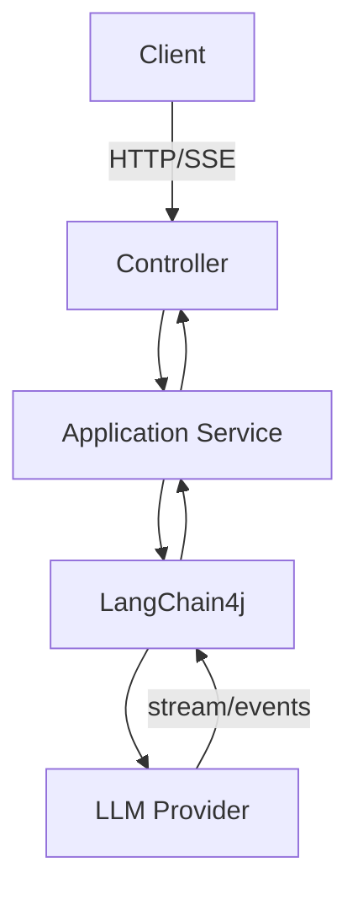

# Day 1: Spring Boot + LangChain4j 原生 StreamingChatModel + SSE

> Phase 0: LangChain4j 基石与原生 LLM 交互

## 今日任务

OpenAiStreamingChatModel、StreamingChatResponseHandler、Flux、SSE。生产代码走 handler → Flux 桥接，不使用 Spring AI。

## 今日必须理解

- 先理解“为什么需要这个抽象”，再记 API。
- LLM 产生的是概率性结果；State、校验、权限、限流、重试和执行隔离必须由工程代码控制。
- 本 Day 不创建第二套 Java 工程，所有实现继续累加到 `/lianghua/agent`。

## 1. 架构图解 (Diagram Mapping)



### 数据流要点

```text
输入
 ↓
认知/编排节点
 ↓
强类型 State / Tool / Adapter
 ↓
可观测结果
 ↓
下一节点或人工确认
```

## 2. Java 传统架构类比 (Mental Model)

**核心类比：** WebClient / Reactive Stream → StreamingChatModel；SSE → WebFlux Event Stream；Adapter → 第三方 SDK 隔离。

### 对 Java 架构师的关键认知

先把 LangChain4j 当作“LLM 基础设施 SDK”，今天学习的是请求、响应、流和协议，而不是 Agent 自主循环。

## 3. 5 分钟 Debug 验证实验

**断点类：** `com.quant.agent.infrastructure.llm.QuantLlmService`

**观察：** `userPrompt、model、onPartialResponse()、onCompleteResponse()、onError()`

### 验收现象

- 能看到状态/事件从上一步流向下一步。
- 能解释每个关键变量是谁写入、谁读取。
- 出现异常时能够指出：是模型层、编排层、工具层还是基础设施层。

## 4. Spec Coding 驱动 Prompt

### Step 1 — 维护四件套 Spec

```text
请先阅读 /lianghua/agent/constitution.md。

在 /lianghua/agent/.specs/day01_spring_boot_plus_langchain4j_原生_streamingchatmodel_plus_sse/ 创建/更新：
spec.md
plan.md
tasks.md
checklist.md

主题：Day 1 / Spring Boot + LangChain4j 原生 StreamingChatModel + SSE

要求：
1. spec.md 写清业务目标、边界、输入输出、失败模式、Definition of Done。
2. plan.md 写清 Java package、接口边界、LangChain4j/LangGraph4j API、数据流和安全边界。
3. tasks.md 按“代码→测试→手工验证”的顺序拆解。
4. checklist.md 必须可逐项打勾，禁止写空泛描述。
5. 不引入 Spring AI，不改变本项目 GA 版本基线。
```

### Step 2 — 驱动实现

```text
严格按照刚才的 spec/plan/tasks 在 /lianghua/agent 中实现 Day 1。

要求：
- 优先复用已有类，不重复造同类基础设施。
- 所有 LLM 输出先做类型/字段校验，再进入 State。
- 工具调用必须经过明确的 Tool/Adapter 边界。
- 失败路径必须可观测。
- 同时更新 tasks.md 与 checklist.md。
- 不修改无关模块。
```

### Step 3 — JUnit 5 验收

```text
为 Day 1 增加 JUnit 5 测试。

要求：
1. 正常路径至少 1 个。
2. 异常/边界路径至少 1 个。
3. 不调用真实生产 LLM，使用 mock/fake fixture。
4. 测试必须验证 State/DTO/Tool Result，而不是只验证“没有抛异常”。
5. 运行 mvn test，并把失败原因写回 checklist.md。
```

## 今日 Definition of Done

- [ ] 能不用看代码解释核心数据流。
- [ ] 能在 Debug 中定位关键状态/事件。
- [ ] Spec 四件套已更新。
- [ ] 单元测试通过。
- [ ] 失败路径已覆盖。
- [ ] 没有引入 beta/snapshot。

## 官方资料入口

https://docs.langchain4j.dev/


## 5. Learn Prompt（认知轮）

完整导师 Prompt：[`/lianghua/learn/prompts/day01-learning.md`](../../../prompts/day01-learning.md)

执行目标：**先理解，不先生成完整代码。** 完成 Learning Gate 后再进入 Engineering Prompt。

## 6. Learning Gate

- [ ] 我能解释今天是什么、为什么需要
- [ ] 我能画出运行链路
- [ ] 我能用 Java 语言做合理类比，并指出类比边界
- [ ] 我完成关键 Debug 实验
- [ ] 我能解释至少一个失败路径
- [ ] 我能不用 README 讲 3~5 分钟

### 下一步：Engineering Evolution

进入 [`/lianghua/agent/prompts/day01-engineering.md`](../../../agent/prompts/day01-engineering.md)，让 Claude/Cursor 在现有工程上做纵向增量，不创建第二套 Demo。
